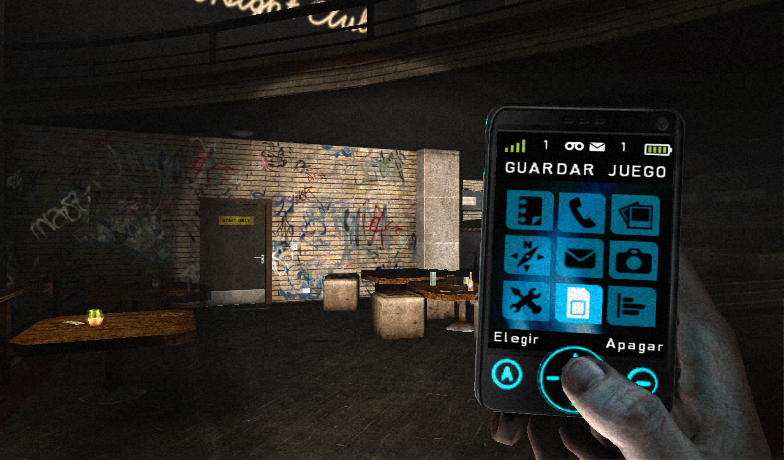

# Hola, mi nombre es Cristian Nieves 👋

- 👋 Hi, I’m @crisanieves
- 👀 I’m interested in Unity3D Develop, C#, HTML, CSS and JavaScript coding
  
### Full-stack Developer & Electronic Engineer

<!--  -->
<!-- 
 -->

Soy ingeniero electrónico profesional desde 2009.

He trabajado en el sector electrónico y en proyectos de software, [crisanieves](https://linkedin.com/in/cristianieves/). Actualmente em dedico a desarrollar aplicaciones, llegando a colaborar con empresas.

Desde 2018 comienzo a crear proyectos personales, compaginándolo con mi actividad como electrónico y actividades extralaborales.

<!--
> 
> ⭐️ [GitHub star](https://stars.github.com/profiles/crisanieves/) -->

## Encuéntrame en:

 

<!--  -->

<!--  -->
<!--  -->

<!-- # Algunos proyectos de la comunidad

## SQL y bases de datos: Curso gratis

## Python desde cero: Curso gratis

## Un día, un lenguaje: Primeros pasos en 11 lenguajes

-->

## Algunos vídeos recomendados en YouTube:
<!--

<table style="width:100%">
<tr>
<td>

</td>
<td>

</td>
</tr>
</table>

 

-->

<!--

## Contacto y apoyo:

[-D14836?style=for-the-badge&logo=gmail&logoColor=white&labelColor=101010)](mailto:crisanieves@gmail.com)
 

-->
